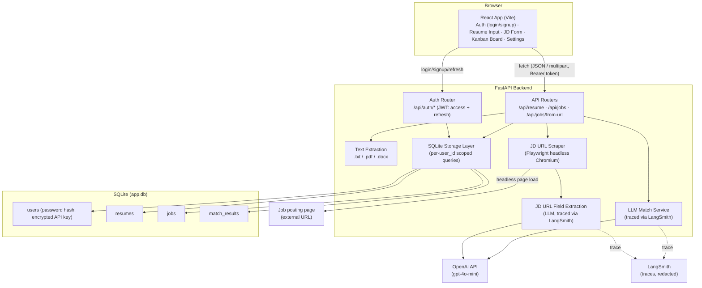
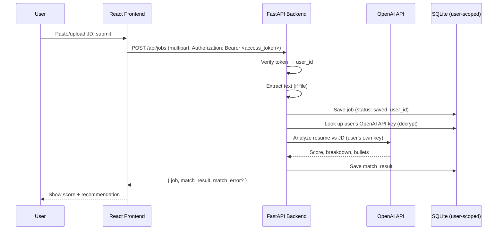
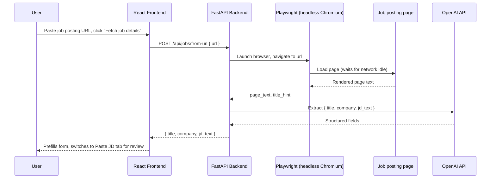
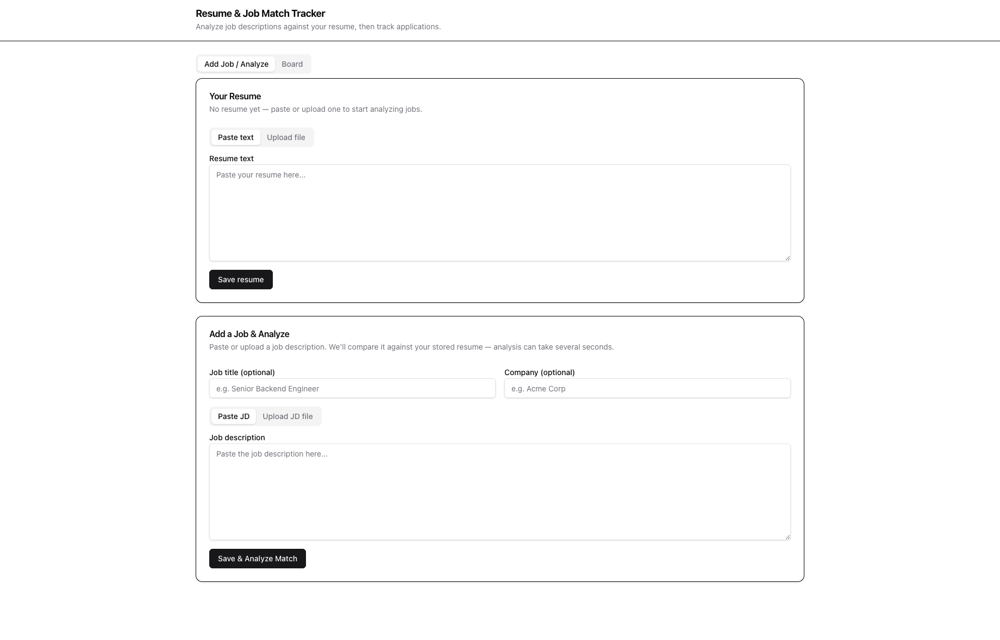
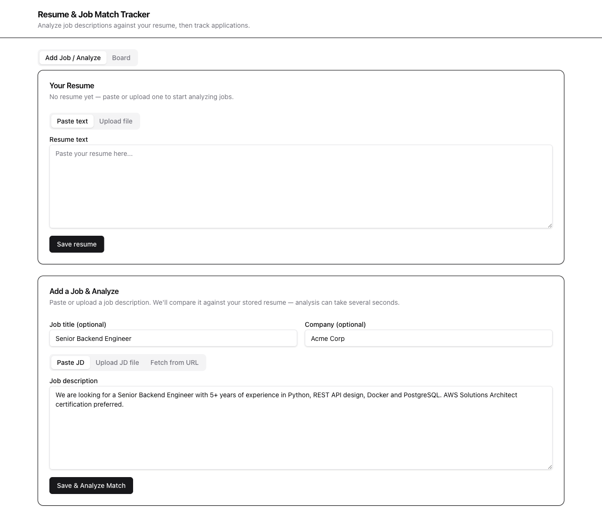
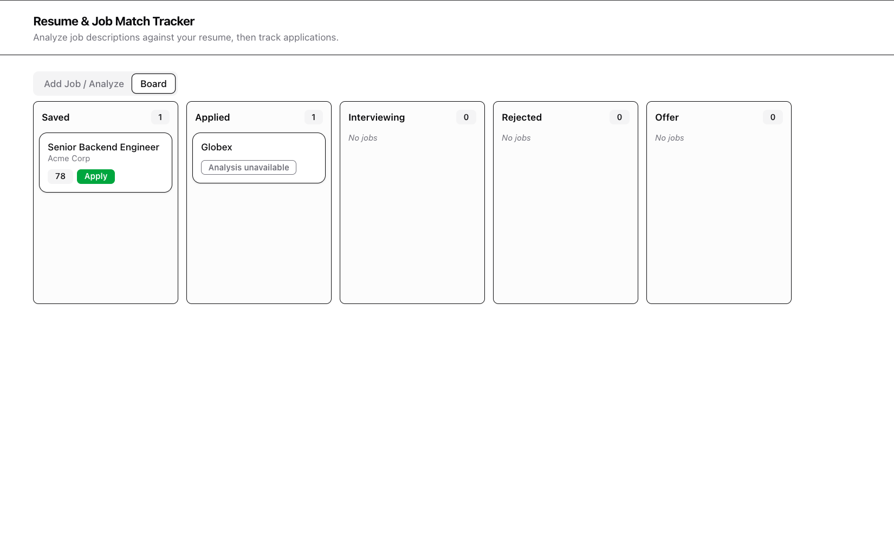

# Resume ↔ Job Match Tracker

A tool that tracks job applications on a Kanban board and uses an LLM to score how well your resume matches a given job description — with a breakdown of matched/missing requirements and rewritten resume bullet suggestions.

Multi-tenant with JWT-based authentication (each user's data is fully isolated, and each user brings their own OpenAI API key), deployed on AWS EC2 behind HTTPS with a GitHub Actions CI/CD pipeline and LangSmith LLM tracing. See [PRD.md](PRD.md) for full product scope, or [PROJECT_STORY.md](PROJECT_STORY.md) for a portfolio-style writeup of the key decisions, trade-offs, and roadmap.

## Architecture



### Request flow: adding a new job



### Request flow: auto-fill JD from a posting URL



Note: this only prefills the form — the job is **not** created until the user reviews the fields and clicks "Save & Analyze Match" (the existing `POST /api/jobs` flow above).

## Tech stack

- **Frontend:** React 18 + Vite + Tailwind CSS 4 (shadcn/ui-style components)
- **Backend:** FastAPI + Uvicorn
- **Storage:** SQLite, multi-tenant (every table scoped by `user_id`) — see `backend/app/storage/`
- **Auth:** JWT dual-token pattern — short-lived access token (frontend memory) + long-lived refresh token (httpOnly cookie) — see `backend/app/routers/auth.py`, `backend/app/services/auth_tokens.py`, `frontend/src/auth/AuthContext.jsx`
- **LLM:** OpenAI `gpt-4o-mini` via the `openai` SDK, using each user's own encrypted API key
- **File parsing:** `pdfplumber` (PDF), `python-docx` (DOCX)
- **JD-from-URL scraping:** Playwright (Python, headless Chromium) — see `backend/app/services/jd_scraper.py`
- **Observability:** LangSmith tracing on both LLM call sites (redacted — see [Observability](#observability-langsmith))
- **Testing:** Playwright (`@playwright/test`) E2E suite (`frontend/e2e/`) + pytest backend suite (`backend/tests/`, including cross-user isolation tests)
- **Deployment:** Docker (multi-stage builds) → AWS EC2 → nginx + Let's Encrypt (HTTPS)
- **CI/CD:** GitHub Actions (`.github/workflows/ci.yml`) — tests + Docker build on every push/PR, auto-deploy to EC2 on merge to `main`

## Getting started

### Prerequisites

- Python 3.9+
- Node.js 18+
- An OpenAI API key (each signed-up user provides their own via the in-app Settings page — see [Authentication](#authentication))

### 1. Backend setup

```bash
cd backend
python3 -m venv .venv
source .venv/bin/activate          # Windows: .venv\Scripts\activate
pip install -r requirements.txt
playwright install chromium        # one-time browser binary download, needed for JD-from-URL scraping
```

Create `backend/.env`:

```
OPENAI_API_KEY=sk-...
JWT_SECRET=...          # generate with: python -c "import secrets; print(secrets.token_hex(32))"
ENCRYPTION_KEY=...       # generate with: python -c "from cryptography.fernet import Fernet; print(Fernet.generate_key().decode())"
```

`OPENAI_API_KEY` here is only used as a fallback for local dev convenience — in normal use, each signed-up user supplies their own key via Settings, and analysis is billed to that key, not this one. `JWT_SECRET` and `ENCRYPTION_KEY` must each be unique per environment (never reuse the same values between local dev and production).

Optionally, for LangSmith tracing (see [Observability](#observability-langsmith)):

```
LANGCHAIN_TRACING_V2=true
LANGCHAIN_API_KEY=lsv2_...
LANGCHAIN_PROJECT=resume-job-match-tracker
```

Start the server:

```bash
uvicorn app.main:app --reload --port 8000
```

Verify it's running: `curl http://localhost:8000/health` → `{"status":"ok"}`

### 2. Frontend setup

In a separate terminal:

```bash
cd frontend
npm install
npm run dev
```

Vite will print the local URL (default `http://localhost:5173`, or the next free port if that's taken).

### 3. Use it

Open the frontend URL in your browser:

1. **Sign up** for an account (email + password, 8+ characters).
2. Go to **Settings** and add your OpenAI API key — required before any job analysis will run; without it, jobs still save but show an actionable "add your API key" message instead of a score.
3. Paste or upload your resume (`.txt`, `.pdf`, or `.docx`).
4. Paste or upload a job description — or paste a job posting URL and click "Fetch job details" to auto-fill the title, company, and description — to get a match score, gap breakdown, and suggested resume bullets.
5. Track the job's status on the Kanban board (Saved → Applied → Interviewing → Rejected/Offer) via drag-and-drop.

## Authentication

Every user's resume, jobs, and match results are fully isolated by `user_id` — enforced at the database query level, not just in application logic. Auth uses a dual-token JWT pattern:

- **Access token** (15 min) — returned in the login/signup response body, held only in frontend memory (never `localStorage` or a cookie). Attached as `Authorization: Bearer <token>` on every API call.
- **Refresh token** (7 days) — set as an `httpOnly`, `SameSite=Lax` cookie, invisible to JavaScript. Used only to silently mint new access tokens via `POST /api/auth/refresh` — including automatically on page load, so reloading the browser doesn't log you out, and transparently on any `401`, so a mid-session token expiry is invisible to the user.

Each user brings their **own OpenAI API key** (Settings page), encrypted at rest with Fernet symmetric encryption and decrypted only at the moment of an LLM call — so usage is billed to that user's account, never a shared key.

## Running with Docker

The whole stack (backend + frontend) can also run as two containers via Docker Compose — no local Python/Node setup needed, aside from Docker itself.

Create `backend/.env` first (same as the manual setup above — needs `OPENAI_API_KEY`, `JWT_SECRET`, and `ENCRYPTION_KEY`), then from the project root:

```bash
docker compose up --build
```

- Frontend: `http://localhost:80`
- Backend: `http://localhost:8000` (health check: `curl http://localhost:8000/health`)

**Backend image:** `python:3.11-slim-bookworm` + Playwright's Chromium (`playwright install --with-deps chromium`). Pinned to `bookworm` (Debian 12) rather than the floating `slim` tag, since Playwright's dependency installer maps OS-specific package names and doesn't recognize newer Debian releases (e.g. "trixie") — using a floating tag risked the image silently breaking on a future rebuild.

**Frontend image:** a multi-stage build — a `node:20-alpine` stage runs `npm run build`, then only the compiled `dist/` output is copied into a final `nginx:alpine` stage (see `frontend/nginx.conf`), so the shipped image contains no Node.js or source code, just static files + nginx as a reverse proxy for `/api`.

**Mock vs. real backend in the Docker build:** Vite bakes `VITE_USE_MOCK` in at build time, not container runtime, so `frontend/Dockerfile` takes it as a build arg (`ARG VITE_USE_MOCK=0`, defaulting to real-backend mode). To build a mock-mode frontend image instead (e.g. for a demo with no API key), override it:

```bash
docker compose build frontend --build-arg VITE_USE_MOCK=1
```

## Testing

**Frontend (Playwright E2E)** — covers resume upload, JD submission, match result display, Kanban board, and the full login/signup/logout flow. Runs against the frontend's built-in mock API, so it needs no backend, database, or network access:

```bash
cd frontend
npm test              # installs the chromium browser binary on first run, then runs all specs headless
npm run test:ui       # interactive UI mode — step through each test with a live browser view
npx playwright test --headed --workers=1   # watch the tests run in a visible browser window, one at a time
```

**Backend (pytest)** — unit tests (password hashing, JWT signing/verification), integration tests (signup/login/refresh/logout via `TestClient`), and a cross-user data-isolation suite (two real accounts, asserting one can never read/list/mutate the other's data through any endpoint). Each test run uses a fresh, isolated SQLite database — never touches `backend/data/app.db`:

```bash
cd backend
python -m pytest tests/ -v
```

Both suites run automatically in CI on every push/PR (see [CI/CD](#cicd) below).

## LLM cost per job analysis

Every job goes through 1–2 calls to `gpt-4o-mini` (OpenAI pricing: ~$0.15 / 1M input tokens, ~$0.60 / 1M output tokens):

| Call | When it runs | Est. tokens (in / out) | Est. cost |
|---|---|---|---|
| `llm_match.analyze()` — resume vs. JD match | Every job save (paste, upload, or after reviewing a URL-fetched JD) | ~1,500–3,000 / ~400–800 | ~$0.0007–0.0012 |
| `jd_url_extract.extract_job_fields()` — URL scrape → structured fields | Only when using "Fetch from URL" | ~4,000–5,500 / ~500–1,000 | ~$0.0013–0.0018 |

**Paste/upload flow:** ≈ $0.001 per job. **Fetch-from-URL flow (fetch + save):** ≈ $0.002–0.003 per job (two calls). At 1,000 job analyses/month this is roughly $1–3 total — already cheap, but the URL-extraction call (which sends the entire scraped page as input) is the more expensive half, and a validation retry (malformed LLM JSON response) roughly doubles the cost of whichever call triggered it.

### Ways to reduce token cost

- **Parse structured JSON-LD before calling the LLM for URL scraping.** Most ATS platforms (Greenhouse, Lever, Workday, Cisco's careers site) embed a `schema.org/JobPosting` block in the page HTML with title/company/description already structured — extracting that directly in `jd_scraper.py` would skip the `jd_url_extract` LLM call entirely for many job boards, falling back to the LLM only when no structured data is found. Biggest lever of the group.
- **Trim scraped page text before sending it to the LLM** instead of a flat character-count truncation — stripping nav/footer/cookie-banner boilerplate first would cut input tokens substantially without losing JD content.
- **Tighten prompt instructions for output length** (e.g. "1–2 concise sentences" for `recommendation_reasoning`/`scoring_method_explanation` in `llm_match.py`) — output tokens cost 4x the input rate.
- **Use OpenAI's strict JSON schema mode** (`response_format: {"type": "json_schema", "strict": true}`) instead of `json_object` to eliminate the validation-failure retry path almost entirely.
- **Keep prompts structured to benefit from OpenAI's automatic prompt caching** — repeated prefixes ≥1024 tokens get a 50% discount, so keeping the system prompt + resume as a stable prefix (already the current order) means repeat analyses against the same resume are partially discounted for free.

## CI/CD

GitHub Actions (`.github/workflows/ci.yml`) runs on every push/PR to `main`:

1. **`backend-tests`** — the pytest suite
2. **`frontend-tests`** — the Playwright E2E suite
3. **`docker-build`** — confirms both Docker images still build (gated behind the two test jobs passing)
4. **`deploy`** — SSHes into the EC2 instance and runs `git pull && docker compose up -d --build`. Only fires on a direct push to `main` (i.e. after a PR merges), never on a PR itself, so unreviewed code never reaches the live server.

Branch protection requires all three test/build checks to pass before a PR can merge.

## Production deployment (AWS EC2 + HTTPS)

The live deployment runs on an EC2 instance behind an Elastic IP (static, survives instance stop/start), fronted by nginx with a free Let's Encrypt certificate (via Certbot in standalone mode, since nginx runs inside the frontend container rather than directly on the host — certificates are obtained on the host filesystem and mounted read-only into the container). `backend/.env` on the server needs the same variables as local dev, plus:

```
ENVIRONMENT=production
```

This flips the refresh-token cookie's `Secure` flag on (only ever sent over HTTPS) — left `false` in local dev, where there's no HTTPS to require.

## Observability (LangSmith)

Both LLM call sites (`llm_match.analyze`, `jd_url_extract.extract_job_fields`) are wrapped with `@traceable` for latency/cost/success visibility, controlled by the `LANGCHAIN_TRACING_V2` env var (a no-op if unset). Each traced function redacts its inputs via a `process_inputs` callback before anything is sent to LangSmith — stripping the OpenAI API key entirely and replacing resume/JD text with `[REDACTED, N chars]`, so a trace shows *that* a call happened and how it performed, never a credential or personal content.

## Screenshots

**Add Job / Analyze** — paste/upload a resume and job description to get a match analysis:



**Fetch from URL** — paste a job posting URL to auto-fill the title, company, and description:



**Board** — Kanban tracker for all saved jobs:



## Project structure

```
backend/
  app/
    main.py                # FastAPI app, CORS, exception handlers, startup (DB init)
    config.py               # env var loading (OpenAI/JWT/encryption keys, ENVIRONMENT)
    dependencies.py         # get_current_user_id — access-token verification dependency
    routers/
      auth.py                # /api/auth/{signup,login,logout,refresh,me}
      resume.py, jobs.py      # /api/resume, /api/jobs, /api/jobs/from-url (all require auth)
    services/
      auth_tokens.py         # JWT create/decode (access + refresh, type-checked)
      text_extraction.py     # .txt/.pdf/.docx → plain text
      llm_match.py            # resume vs JD analysis via OpenAI (LangSmith-traced)
      jd_scraper.py            # Playwright headless-Chromium page fetch for JD-from-URL
      jd_url_extract.py        # LLM extraction of {title, company, jd_text} (LangSmith-traced)
    storage/
      db.py                   # SQLite connection + schema (users, resumes, jobs, match_results)
      user_store.py            # signup/login persistence, password hashing, API key encryption
      resume_store.py, job_store.py, match_store.py   # all user_id-scoped
  tests/                    # pytest: unit, integration, cross-user isolation
  data/                      # app.db (gitignored)

frontend/
  src/
    api/client.js            # fetch wrapper — authorizedRequest() attaches access token,
                              # single-flight refresh-and-retry on 401
    api/mock.js               # in-memory mock backend used in dev/tests (VITE_USE_MOCK=1)
    auth/AuthContext.jsx       # in-memory access token, silent refresh on load
    components/
      Auth/AuthPage.jsx         # login/signup
      Settings/SettingsPage.jsx  # OpenAI API key entry
      ResumeInput, JobDescriptionForm, MatchResultView, SuggestedBullets,
      KanbanBoard, JobCard, ui/*
  e2e/                        # Playwright E2E specs incl. auth.spec.js

.github/workflows/ci.yml    # test + build + deploy pipeline
docker-compose.yml, backend/Dockerfile, frontend/Dockerfile, frontend/nginx.conf
tasks-frontend.md / tasks-backend.md / tasks-database.md / tasks-README.md   # implementation task specs
PRD.md                        # full product requirements
PROJECT_STORY.md              # portfolio-style writeup of key decisions and trade-offs
```

## Notes & limitations

- **No refresh-token rotation** — the refresh token isn't replaced on each use, a further hardening step some production systems add. Acceptable at this scale; a deliberate, flagged simplification.
- **No password reset or email verification** — not required for a personal-scale app; would be the first addition if this ever needed public signups.
- **No OCR** — scanned/image-only PDFs and image files (`.png`/`.jpg`) are not supported; only files with an extractable text layer.
- **SQLite** — fine at this scale; the concurrency limitation that would eventually motivate a move to PostgreSQL is a single-writer lock on the whole file, not a concern until real concurrent write traffic exists.
- **JD-from-URL scraping has real-world limits** — works well on standard company career pages and boards (Greenhouse, Lever, Workday-style sites like Cisco's, etc.), including JS-rendered SPAs since the scraper waits for the network to settle before reading the page. It does **not** log in anywhere: sites that gate job descriptions behind a login wall (e.g. LinkedIn) will typically return a "could not find a job description" error, and users should paste the description manually in that case.
