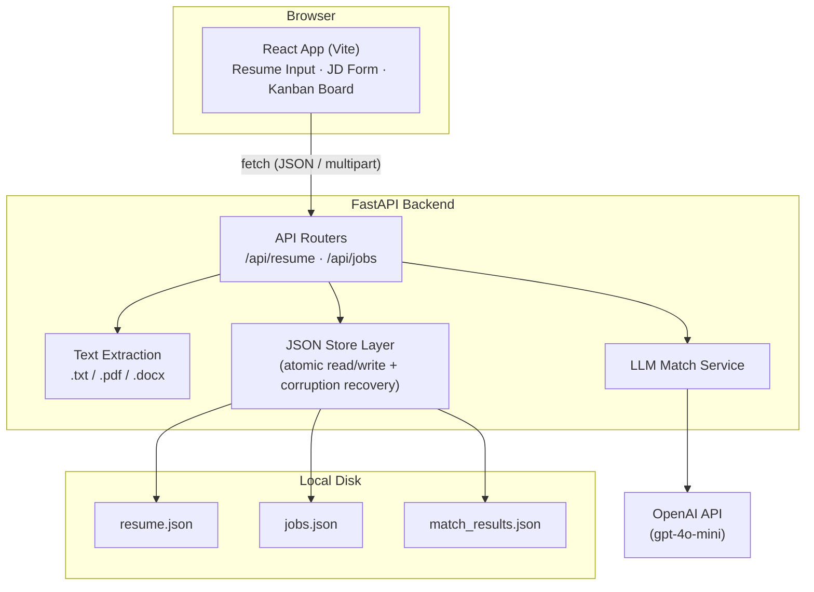
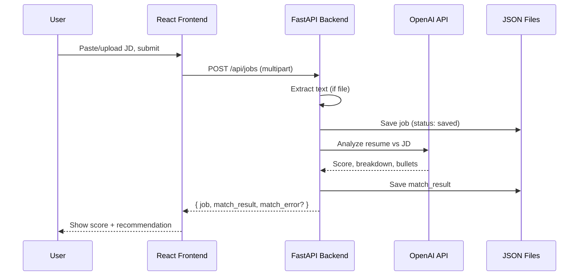

# Resume ↔ Job Match Tracker

A personal, local-only tool that tracks job applications on a Kanban board and uses an LLM to score how well your resume matches a given job description — with a breakdown of matched/missing requirements and rewritten resume bullet suggestions.

Single-user, no auth, no hosting — runs entirely on your own machine. See [PRD.md](PRD.md) for full product scope.

## Architecture



### Request flow: adding a new job



## Tech stack

- **Frontend:** React 18 + Vite + Tailwind CSS 4 (shadcn/ui-style components)
- **Backend:** FastAPI + Uvicorn
- **Storage:** Flat JSON files on disk (no database) — see `backend/app/storage/`
- **LLM:** OpenAI `gpt-4o-mini` via the `openai` SDK
- **File parsing:** `pdfplumber` (PDF), `python-docx` (DOCX)

## Getting started

### Prerequisites

- Python 3.9+
- Node.js 18+
- An OpenAI API key

### 1. Backend setup

```bash
cd backend
python3 -m venv .venv
source .venv/bin/activate          # Windows: .venv\Scripts\activate
pip install -r requirements.txt
```

Create `backend/.env` with your API key:

```
OPENAI_API_KEY=sk-...
```

Start the server:

```bash
uvicorn app.main:app --reload --port 8000
```

Verify it's running: `curl http://localhost:8000/health` → `{"status":"ok"}`

### 2. Frontend setup

In a separate terminal:

```bash
cd frontend
npm install
npm run dev
```

Vite will print the local URL (default `http://localhost:5173`, or the next free port if that's taken).

### 3. Use it

Open the frontend URL in your browser:

1. Paste or upload your resume (`.txt`, `.pdf`, or `.docx`).
2. Paste or upload a job description to get a match score, gap breakdown, and suggested resume bullets.
3. Track the job's status on the Kanban board (Saved → Applied → Interviewing → Rejected/Offer) via drag-and-drop.

## Project structure

```
backend/
  app/
    main.py              # FastAPI app, CORS, exception handlers
    config.py             # env var loading (OPENAI_API_KEY, upload limits)
    routers/               # /api/resume, /api/jobs endpoints
    services/
      text_extraction.py  # .txt/.pdf/.docx → plain text
      llm_match.py         # resume vs JD analysis via OpenAI
    storage/               # JSON file read/write + corruption recovery
  data/                    # resume.json, jobs.json, match_results.json (gitignored)

frontend/
  src/
    api/client.js          # fetch wrapper for the backend API
    components/            # ResumeInput, JobDescriptionForm, MatchResultView,
                            # SuggestedBullets, KanbanBoard, JobCard, ui/*

tasks-frontend.md / tasks-backend.md / tasks-database.md   # implementation task specs
PRD.md                                                      # full product requirements
```

## Notes & limitations

- **Single user, local only** — no authentication or multi-tenancy (see PRD's Scalability/Out-of-Scope sections).
- **No OCR** — scanned/image-only PDFs and image files (`.png`/`.jpg`) are not supported; only files with an extractable text layer.
- **JSON file storage** — simple and fine at low volume, but no query engine or multi-writer concurrency protection. Corrupted files are auto-backed-up (`<name>.corrupt.<timestamp>.json`) and reset rather than crashing the app.
