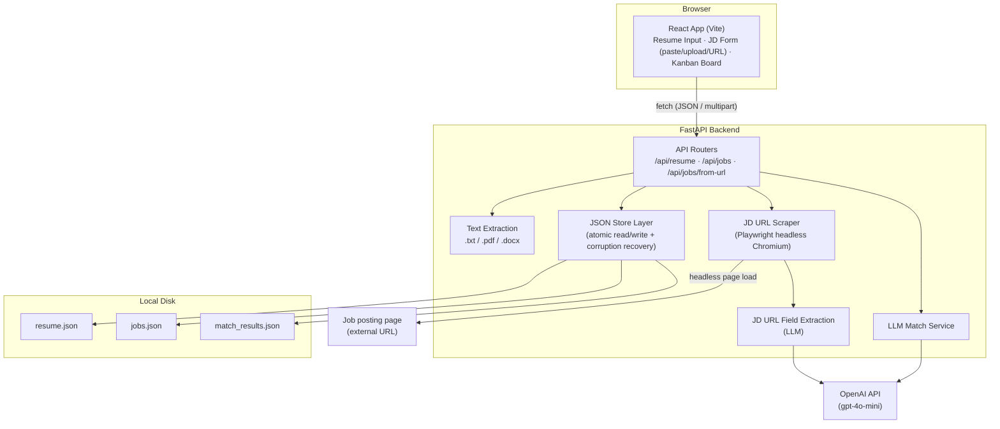
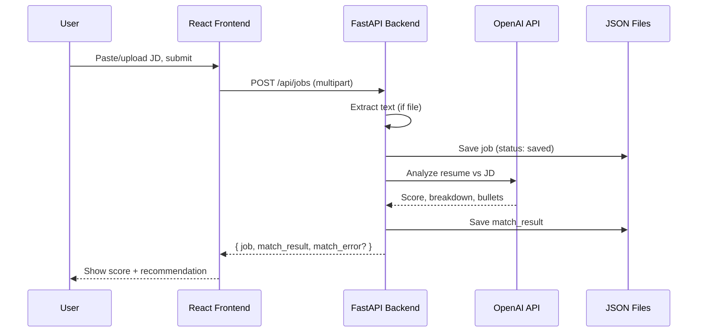
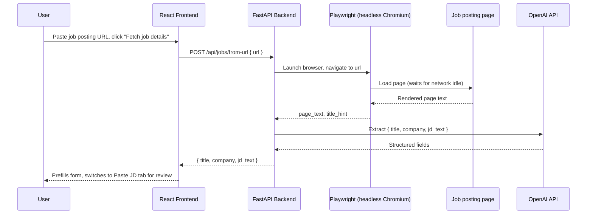

# Resume ↔ Job Match Tracker

A personal, local-only tool that tracks job applications on a Kanban board and uses an LLM to score how well your resume matches a given job description — with a breakdown of matched/missing requirements and rewritten resume bullet suggestions.

Single-user, no auth, no hosting — runs entirely on your own machine. See [PRD.md](PRD.md) for full product scope, or [PROJECT_STORY.md](PROJECT_STORY.md) for a portfolio-style writeup of the key decisions, trade-offs, and roadmap.

## Architecture



### Request flow: adding a new job



### Request flow: auto-fill JD from a posting URL



Note: this only prefills the form — the job is **not** created until the user reviews the fields and clicks "Save & Analyze Match" (the existing `POST /api/jobs` flow above).

## Tech stack

- **Frontend:** React 18 + Vite + Tailwind CSS 4 (shadcn/ui-style components)
- **Backend:** FastAPI + Uvicorn
- **Storage:** Flat JSON files on disk (no database) — see `backend/app/storage/`
- **LLM:** OpenAI `gpt-4o-mini` via the `openai` SDK
- **File parsing:** `pdfplumber` (PDF), `python-docx` (DOCX)
- **JD-from-URL scraping:** Playwright (Python, headless Chromium) — see `backend/app/services/jd_scraper.py`
- **E2E testing:** Playwright (`@playwright/test`) against the frontend's built-in mock API — see `frontend/e2e/`

## Getting started

### Prerequisites

- Python 3.9+
- Node.js 18+
- An OpenAI API key

### 1. Backend setup

```bash
cd backend
python3 -m venv .venv
source .venv/bin/activate          # Windows: .venv\Scripts\activate
pip install -r requirements.txt
playwright install chromium        # one-time browser binary download, needed for JD-from-URL scraping
```

Create `backend/.env` with your API key:

```
OPENAI_API_KEY=sk-...
```

Start the server:

```bash
uvicorn app.main:app --reload --port 8000
```

Verify it's running: `curl http://localhost:8000/health` → `{"status":"ok"}`

### 2. Frontend setup

In a separate terminal:

```bash
cd frontend
npm install
npm run dev
```

Vite will print the local URL (default `http://localhost:5173`, or the next free port if that's taken).

### 3. Use it

Open the frontend URL in your browser:

1. Paste or upload your resume (`.txt`, `.pdf`, or `.docx`).
2. Paste or upload a job description — or paste a job posting URL and click "Fetch job details" to auto-fill the title, company, and description — to get a match score, gap breakdown, and suggested resume bullets.
3. Track the job's status on the Kanban board (Saved → Applied → Interviewing → Rejected/Offer) via drag-and-drop.

## Testing

The frontend has a Playwright E2E suite covering resume upload, JD submission, match result display, and Kanban board interactions. It runs against the frontend's built-in mock API, so it needs no backend or network access:

```bash
cd frontend
npm test              # installs the chromium browser binary on first run, then runs all specs headless
npm run test:ui       # interactive UI mode — step through each test with a live browser view
npx playwright test --headed --workers=1   # watch the tests run in a visible browser window, one at a time
```

## LLM cost per job analysis

Every job goes through 1–2 calls to `gpt-4o-mini` (OpenAI pricing: ~$0.15 / 1M input tokens, ~$0.60 / 1M output tokens):

| Call | When it runs | Est. tokens (in / out) | Est. cost |
|---|---|---|---|
| `llm_match.analyze()` — resume vs. JD match | Every job save (paste, upload, or after reviewing a URL-fetched JD) | ~1,500–3,000 / ~400–800 | ~$0.0007–0.0012 |
| `jd_url_extract.extract_job_fields()` — URL scrape → structured fields | Only when using "Fetch from URL" | ~4,000–5,500 / ~500–1,000 | ~$0.0013–0.0018 |

**Paste/upload flow:** ≈ $0.001 per job. **Fetch-from-URL flow (fetch + save):** ≈ $0.002–0.003 per job (two calls). At 1,000 job analyses/month this is roughly $1–3 total — already cheap, but the URL-extraction call (which sends the entire scraped page as input) is the more expensive half, and a validation retry (malformed LLM JSON response) roughly doubles the cost of whichever call triggered it.

### Ways to reduce token cost

- **Parse structured JSON-LD before calling the LLM for URL scraping.** Most ATS platforms (Greenhouse, Lever, Workday, Cisco's careers site) embed a `schema.org/JobPosting` block in the page HTML with title/company/description already structured — extracting that directly in `jd_scraper.py` would skip the `jd_url_extract` LLM call entirely for many job boards, falling back to the LLM only when no structured data is found. Biggest lever of the group.
- **Trim scraped page text before sending it to the LLM** instead of a flat character-count truncation — stripping nav/footer/cookie-banner boilerplate first would cut input tokens substantially without losing JD content.
- **Tighten prompt instructions for output length** (e.g. "1–2 concise sentences" for `recommendation_reasoning`/`scoring_method_explanation` in `llm_match.py`) — output tokens cost 4x the input rate.
- **Use OpenAI's strict JSON schema mode** (`response_format: {"type": "json_schema", "strict": true}`) instead of `json_object` to eliminate the validation-failure retry path almost entirely.
- **Keep prompts structured to benefit from OpenAI's automatic prompt caching** — repeated prefixes ≥1024 tokens get a 50% discount, so keeping the system prompt + resume as a stable prefix (already the current order) means repeat analyses against the same resume are partially discounted for free.

## Screenshots

**Add Job / Analyze** — paste/upload a resume and job description to get a match analysis:


**Fetch from URL** — paste a job posting URL to auto-fill the title, company, and description:


**Board** — Kanban tracker for all saved jobs:


## Project structure

```
backend/
  app/
    main.py              # FastAPI app, CORS, exception handlers
    config.py             # env var loading (OPENAI_API_KEY, upload limits)
    routers/               # /api/resume, /api/jobs, /api/jobs/from-url endpoints
    services/
      text_extraction.py  # .txt/.pdf/.docx → plain text
      llm_match.py         # resume vs JD analysis via OpenAI
      jd_scraper.py         # Playwright headless-Chromium page fetch for JD-from-URL
      jd_url_extract.py     # LLM extraction of {title, company, jd_text} from scraped text
    storage/               # JSON file read/write + corruption recovery
  data/                    # resume.json, jobs.json, match_results.json (gitignored)

frontend/
  src/
    api/client.js          # fetch wrapper for the backend API (incl. fetchJobFromUrl)
    api/mock.js             # in-memory mock backend used in dev/tests (VITE_USE_MOCK=1)
    components/             # ResumeInput, JobDescriptionForm (paste/upload/URL tabs),
                            # MatchResultView, SuggestedBullets, KanbanBoard, JobCard, ui/*
  e2e/                      # Playwright E2E specs (resume upload, JD submission,
                            # match result display, Kanban board) + fixtures/helpers
  playwright.config.js      # runs the E2E suite against the mock API on a dedicated port

tasks-frontend.md / tasks-backend.md / tasks-database.md   # implementation task specs
PRD.md                                                      # full product requirements
```

## Notes & limitations

- **Single user, local only** — no authentication or multi-tenancy (see PRD's Scalability/Out-of-Scope sections).
- **No OCR** — scanned/image-only PDFs and image files (`.png`/`.jpg`) are not supported; only files with an extractable text layer.
- **JSON file storage** — simple and fine at low volume, but no query engine or multi-writer concurrency protection. Corrupted files are auto-backed-up (`<name>.corrupt.<timestamp>.json`) and reset rather than crashing the app.
- **JD-from-URL scraping has real-world limits** — works well on standard company career pages and boards (Greenhouse, Lever, Workday-style sites like Cisco's, etc.), including JS-rendered SPAs since the scraper waits for the network to settle before reading the page. It does **not** log in anywhere: sites that gate job descriptions behind a login wall (e.g. LinkedIn) will typically return a "could not find a job description" error, and users should paste the description manually in that case.
